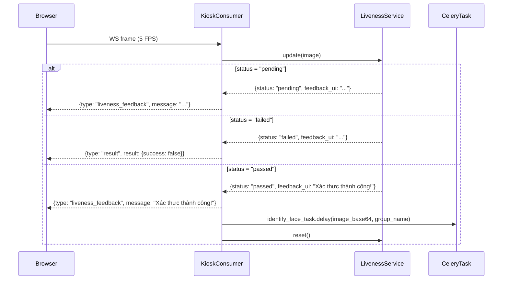

# Design Document: Hybrid Liveness Detection

## Overview

Module `LivenessService` hiện tại đã có kiến trúc đúng hướng (EAR + PnP) nhưng thiếu Layer 3 (Temporal Consistency) và chưa có cơ chế chống video replay chất lượng cao. Thiết kế này nâng cấp `liveness_service.py` thành hệ thống **3-layer hybrid** với:

- **Layer 1 — Blink Detection**: EAR Amplitude trên frame buffer (đã có, cần tinh chỉnh ngưỡng)
- **Layer 2 — Head Movement (PnP)**: Góc xoay 3D thật sự (đã có, cần điều chỉnh ngưỡng)
- **Layer 3 — Temporal Consistency**: Độ lệch chuẩn EAR + phân tích tương quan EAR/yaw để chống spoofing

Mục tiêu: người thật pass trong ≤ 8 giây, ảnh tĩnh/video replay bị từ chối với độ chính xác cao.

Tất cả thay đổi nằm trong `attendance/services/liveness_service.py`. Interface công khai (`update()`, `reset()`) giữ nguyên để `KioskConsumer` không cần sửa đổi.

---

## Architecture



### Luồng xử lý trong LivenessService.update()

```mermaid
flowchart TD
    A[Nhận frame mới] --> B{Timeout > 8s?}
    B -->|Yes| C[reset() → return failed]
    B -->|No| D[MediaPipe FaceMesh]
    D -->|No face| E[return pending: Không tìm thấy khuôn mặt]
    D -->|Face found| F[Tính EAR trái + phải → avg]
    F --> G[cv2.solvePnP → pitch, yaw]
    G --> H[Thêm vào frame_buffer, giới hạn 30]
    H --> I{buffer >= 5?}
    I -->|No| J[return pending: thu thập frame]
    I -->|Yes| K[Layer 1: EAR Amplitude]
    K --> L[Layer 2: Yaw/Pitch Range]
    L --> M{buffer >= 10?}
    M -->|Yes| N[Layer 3: Temporal Std]
    M -->|No| O[consistency_passed = False]
    N --> P{buffer >= 15?}
    P -->|Yes| Q[Spoofing: EAR-Yaw Correlation]
    P -->|No| R[skip correlation check]
    Q --> S{|corr| > 0.95?}
    S -->|Yes| T[reset() → return failed: spoofing]
    S -->|No| U[Hybrid Decision]
    O --> U
    R --> U
    U --> V{blink AND movement AND consistency?}
    V -->|Yes| W[return passed]
    V -->|No| X[return pending: dynamic feedback]
```

---

## Components and Interfaces

### LivenessService (attendance/services/liveness_service.py)

Lớp duy nhất cần thay đổi. Mỗi `KioskConsumer` tạo một instance riêng — không dùng singleton.

```python
class LivenessService:
    def __init__(self):
        """
        Khởi tạo MediaPipe FaceMesh và đọc cấu hình từ Django settings.
        Import mediapipe lazy (bên trong __init__) để không làm chậm startup.
        """
        ...

    def update(self, image: np.ndarray) -> dict:
        """
        Xử lý một frame mới và trả về trạng thái liveness.
        
        Returns:
            {
                "status": "pending" | "passed" | "failed",
                "feedback_ui": str  # Thông báo hiển thị cho người dùng
            }
        """
        ...

    def reset(self) -> None:
        """Xóa toàn bộ trạng thái phiên, chuẩn bị cho phiên mới."""
        ...

    def compute_ear(self, landmarks: list, eye_indices: list) -> float:
        """Tính Eye Aspect Ratio từ 6 điểm landmark."""
        ...

    def estimate_head_pose(self, image: np.ndarray, face_landmarks: list) -> tuple:
        """
        Ước lượng góc xoay đầu (pitch, yaw, roll) bằng cv2.solvePnP.
        Returns: (pitch, yaw, roll) hoặc (0.0, 0.0, 0.0) nếu thất bại.
        """
        ...

    def _check_temporal_consistency(self) -> bool:
        """
        Layer 3: Kiểm tra độ lệch chuẩn EAR trong [STD_MIN, STD_MAX].
        Chỉ gọi khi buffer >= 10 frame.
        """
        ...

    def _check_spoofing_correlation(self) -> bool:
        """
        Anti-spoofing: Kiểm tra tương quan EAR-yaw.
        Chỉ gọi khi buffer >= 15 frame.
        Returns True nếu phát hiện spoofing.
        """
        ...
```

### KioskConsumer (attendance/consumers.py)

Không thay đổi logic. Interface `update()` và `reset()` giữ nguyên. Consumer đã xử lý đúng các trạng thái `pending`, `passed`, `failed`.

### Cấu hình Django Settings

Thêm vào `myproject/settings.py` (tùy chọn, có giá trị mặc định):

```python
# Hybrid Liveness Detection Thresholds
LIVENESS_EAR_THRESHOLD = 0.22          # Ngưỡng EAR tối thiểu khi mắt nhắm
LIVENESS_EAR_AMPLITUDE_MIN = 0.08      # Biên độ EAR tối thiểu để xác nhận nháy mắt
LIVENESS_YAW_RANGE_MIN = 8.0           # Góc yaw tối thiểu (độ)
LIVENESS_PITCH_RANGE_MIN = 6.0         # Góc pitch tối thiểu (độ)
LIVENESS_TEMPORAL_STD_MIN = 0.005      # Độ lệch chuẩn EAR tối thiểu (chống ảnh tĩnh)
LIVENESS_TEMPORAL_STD_MAX = 0.08       # Độ lệch chuẩn EAR tối đa (chống lắc điện thoại)
LIVENESS_TIMEOUT_SECONDS = 8.0         # Thời gian tối đa một phiên
```

---

## Data Models

### Frame Buffer Entry

Mỗi entry trong `frame_buffer` là một `dict` chứa các giá trị số đã tính toán — **không lưu ảnh gốc**:

```python
{
    "timestamp": float,   # time.time() khi frame được xử lý
    "ear": float,         # EAR trung bình (trái + phải) / 2
    "pitch": float,       # Góc pitch (độ) từ PnP
    "yaw": float,         # Góc yaw (độ) từ PnP
}
```

### Trạng thái phiên (instance variables)

```python
# Cờ trạng thái 3 layer
self.blink_detected: bool       # Layer 1 đã pass
self.movement_detected: bool    # Layer 2 đã pass
self.consistency_passed: bool   # Layer 3 đã pass

# Buffer
self.frame_buffer: list[dict]   # Tối đa 30 entries
self.history_size: int = 30     # Giới hạn buffer

# Timing
self.session_start: float       # time.time() khi phiên bắt đầu

# Cấu hình (đọc từ settings khi __init__)
self.EAR_THRESHOLD: float
self.EAR_AMPLITUDE_MIN: float
self.YAW_RANGE_MIN: float
self.PITCH_RANGE_MIN: float
self.TEMPORAL_STD_MIN: float
self.TEMPORAL_STD_MAX: float
self.timeout_seconds: float
```

### Landmark Indices (hằng số)

```python
LEFT_EYE  = [33, 160, 158, 133, 153, 144]   # 6 điểm mắt trái MediaPipe
RIGHT_EYE = [362, 385, 387, 263, 373, 380]  # 6 điểm mắt phải MediaPipe

# 6 điểm cho PnP (index trong 468 landmarks MediaPipe)
PNP_LANDMARKS = {
    "nose_tip":          1,
    "chin":              152,
    "left_eye_corner":   33,
    "right_eye_corner":  263,
    "left_mouth":        61,
    "right_mouth":       291,
}

# 3D model points tương ứng (mm, hệ tọa độ chuẩn)
PNP_3D_POINTS = np.array([
    (0.0, 0.0, 0.0),          # Nose tip
    (0.0, -330.0, -65.0),     # Chin
    (-225.0, 170.0, -135.0),  # Left eye corner
    (225.0, 170.0, -135.0),   # Right eye corner
    (-150.0, -150.0, -125.0), # Left mouth corner
    (150.0, -150.0, -125.0),  # Right mouth corner
], dtype=np.float64)
```

---

## Correctness Properties

*A property is a characteristic or behavior that should hold true across all valid executions of a system — essentially, a formal statement about what the system should do. Properties serve as the bridge between human-readable specifications and machine-verifiable correctness guarantees.*

### Property 1: Trạng thái khởi tạo và reset là tương đương

*For any* `LivenessService` instance, ngay sau khi khởi tạo (`__init__`) hoặc sau khi gọi `reset()`, trạng thái phải giống hệt nhau: `frame_buffer` rỗng, `blink_detected = False`, `movement_detected = False`, `consistency_passed = False`.

**Validates: Requirements 1.1, 1.2**

---

### Property 2: Frame Buffer bị giới hạn bởi history_size

*For any* số lượng frame N được thêm vào `LivenessService` (dù N lớn tùy ý), `len(frame_buffer)` phải luôn ≤ `history_size` (30).

**Validates: Requirements 1.3, 7.3**

---

### Property 3: Blink detection kích hoạt đúng điều kiện

*For any* chuỗi EAR với ít nhất 5 giá trị, `blink_detected` phải là `True` khi và chỉ khi `max(ears) - min(ears) > EAR_AMPLITUDE_MIN` VÀ `min(ears) < EAR_THRESHOLD`. Với mọi chuỗi không thỏa mãn điều kiện này, `blink_detected` phải là `False`.

**Validates: Requirements 2.1, 2.2**

---

### Property 4: Detection flags là idempotent (không thể đảo ngược)

*For any* `LivenessService` ở trạng thái `blink_detected = True` hoặc `movement_detected = True`, việc thêm bất kỳ số lượng frame nào tiếp theo không được làm thay đổi flag đó về `False`.

**Validates: Requirements 2.6, 3.6**

---

### Property 5: Movement detection kích hoạt đúng điều kiện

*For any* chuỗi góc yaw và pitch với ít nhất 5 giá trị, `movement_detected` phải là `True` khi và chỉ khi `max(yaws) - min(yaws) > YAW_RANGE_MIN` HOẶC `max(pitches) - min(pitches) > PITCH_RANGE_MIN`.

**Validates: Requirements 3.4**

---

### Property 6: Temporal consistency phụ thuộc đúng vào độ lệch chuẩn EAR

*For any* chuỗi EAR với ít nhất 10 giá trị, `consistency_passed` phải là `True` khi và chỉ khi `TEMPORAL_STD_MIN ≤ std(ears) ≤ TEMPORAL_STD_MAX`. Với buffer ít hơn 10 frame, `consistency_passed` phải là `False`.

**Validates: Requirements 4.1, 4.2, 4.3, 4.4, 4.5**

---

### Property 7: Quyết định tổng hợp và feedback động

*For any* trạng thái `LivenessService`, `update()` phải trả về `status = "passed"` khi và chỉ khi cả ba flag đều `True`. Khi `status = "pending"`, `feedback_ui` phải chứa gợi ý cho đúng các bước còn thiếu: "chớp mắt" nếu `blink_detected = False`, "quay đầu nhẹ" nếu `movement_detected = False`, "giữ nguyên tư thế" nếu `consistency_passed = False`.

**Validates: Requirements 5.1, 5.3, 5.5**

---

### Property 8: Interface output luôn hợp lệ

*For any* ảnh đầu vào (kể cả ảnh trống, ảnh nhiễu, ảnh không có khuôn mặt), `update()` phải luôn trả về một `dict` với key `"status"` (giá trị trong `{"pending", "passed", "failed"}`) và key `"feedback_ui"` (chuỗi không rỗng). Không được raise exception.

**Validates: Requirements 8.1**

---

### Property 9: Frame Buffer chỉ chứa dữ liệu số, không chứa ảnh

*For any* frame được thêm vào `LivenessService`, mỗi entry trong `frame_buffer` chỉ được chứa các key `timestamp`, `ear`, `pitch`, `yaw` với giá trị kiểu số — không được chứa `np.ndarray` hay dữ liệu ảnh.

**Validates: Requirements 7.5**

---

### Property 10: Instance isolation — các instance độc lập nhau

*For any* hai `LivenessService` instances A và B, thay đổi trạng thái của A (thêm frame, gọi reset) không được ảnh hưởng đến trạng thái của B.

**Validates: Requirements 7.4**

---

### Property 11: Spoofing detection kích hoạt reset và trả về failed

*For any* chuỗi EAR và yaw với ít nhất 15 giá trị mà `|correlation(ears, yaws)| > 0.95`, `update()` phải trả về `status = "failed"` với thông báo spoofing, VÀ `frame_buffer` phải rỗng sau đó (reset đã được gọi).

**Validates: Requirements 9.1, 9.2, 9.4**

---

### Property 12: Cấu hình từ settings được áp dụng đúng

*For any* cấu hình Django settings với các giá trị `LIVENESS_*` tùy ý hợp lệ, `LivenessService` phải sử dụng đúng các giá trị đó thay vì giá trị mặc định. Khi không có settings, phải dùng đúng giá trị mặc định đã định nghĩa.

**Validates: Requirements 10.1, 10.2**

---

## Error Handling

### MediaPipe không phát hiện khuôn mặt
- **Hành vi**: Bỏ qua frame, trả về `{"status": "pending", "feedback_ui": "Không tìm thấy khuôn mặt rõ ràng."}`
- **Không** tăng bộ đếm lỗi hay reset phiên — người dùng chỉ cần điều chỉnh vị trí

### cv2.solvePnP thất bại
- **Hành vi**: Bỏ qua frame đó, không cập nhật pitch/yaw trong buffer entry
- **Lý do**: Có thể xảy ra khi khuôn mặt ở góc cực đoan; không nên phạt người dùng

### Timeout (> 8 giây)
- **Hành vi**: Gọi `reset()`, trả về `{"status": "failed", "feedback_ui": "Hết thời gian, vui lòng thử lại."}`
- **Lý do**: Ngăn phiên zombie chiếm tài nguyên

### Spoofing phát hiện
- **Hành vi**: Gọi `reset()`, trả về `{"status": "failed", "feedback_ui": "Phát hiện hành vi bất thường, vui lòng thử lại tự nhiên."}`
- **Log**: `logger.warning()` với timestamp, correlation value, session duration

### Temporal consistency thất bại (sau 10+ frame)
- **Hành vi**: Trả về `{"status": "failed", "feedback_ui": "Phát hiện hành vi bất thường, vui lòng thử lại tự nhiên."}`, gọi `reset()`
- **Phân biệt**: std < 0.005 → ảnh tĩnh; std > 0.08 → lắc điện thoại

### mediapipe chưa cài đặt
- **Hành vi**: `__init__` raise `ImportError("mediapipe is required. Run: pip install mediapipe")`
- **Lý do**: Fail fast với thông báo rõ ràng thay vì lỗi khó hiểu sau

### Exception không mong đợi trong update()
- **Hành vi**: Log error, trả về `{"status": "pending", "feedback_ui": "Lỗi xử lý frame, vui lòng thử lại."}` — không crash consumer

---

## Testing Strategy

### Thư viện Property-Based Testing

Sử dụng **Hypothesis** (Python) — thư viện PBT chuẩn cho Python, tích hợp tốt với pytest.

```bash
pip install hypothesis pytest
```

### Cấu trúc thư mục test

```
attendance/tests/
├── test_liveness_service.py        # Unit + Property tests cho LivenessService
├── test_liveness_integration.py    # Integration tests cho KioskConsumer + LivenessService
└── __init__.py
```

### Unit Tests (pytest)

Các test cụ thể cho edge cases và behavior đặc thù:

```python
# test_liveness_service.py

def test_timeout_triggers_failed_and_reset():
    """Req 1.4: Timeout sau 8s trả về failed và reset."""
    ...

def test_no_face_returns_pending():
    """Req 2.5: Ảnh không có khuôn mặt trả về pending."""
    ...

def test_pnp_failure_skips_frame():
    """Req 3.5: solvePnP thất bại không crash."""
    ...

def test_consistency_failed_triggers_reset():
    """Req 5.4: Temporal consistency thất bại sau 10 frame."""
    ...

def test_mediapipe_import_error():
    """Req 8.5: ImportError rõ ràng khi mediapipe chưa cài."""
    ...

def test_landmark_indices_correct():
    """Req 2.4: LEFT_EYE và RIGHT_EYE indices đúng."""
    ...

def test_default_thresholds_without_settings():
    """Req 10.2: Giá trị mặc định khi không có settings."""
    ...

def test_spoofing_logs_warning():
    """Req 9.3: Log WARNING khi phát hiện spoofing."""
    ...
```

### Property-Based Tests (Hypothesis)

Mỗi property test chạy tối thiểu **100 iterations**. Tag format: `# Feature: hybrid-liveness-detection, Property N: <text>`

```python
from hypothesis import given, settings
from hypothesis import strategies as st

@given(
    n_frames=st.integers(min_value=0, max_value=100)
)
@settings(max_examples=100)
def test_property_1_init_and_reset_equivalent(n_frames):
    """
    Feature: hybrid-liveness-detection, Property 1: init and reset produce identical state
    """
    ...

@given(
    n_frames=st.integers(min_value=31, max_value=200)
)
@settings(max_examples=100)
def test_property_2_buffer_bounded(n_frames):
    """
    Feature: hybrid-liveness-detection, Property 2: frame buffer never exceeds history_size
    """
    ...

@given(
    ears=st.lists(st.floats(min_value=0.1, max_value=0.5), min_size=5, max_size=30)
)
@settings(max_examples=200)
def test_property_3_blink_detection_condition(ears):
    """
    Feature: hybrid-liveness-detection, Property 3: blink detection activates on correct condition
    """
    ...

@given(
    ears=st.lists(st.floats(min_value=0.1, max_value=0.5), min_size=5, max_size=30),
    yaws=st.lists(st.floats(min_value=-30.0, max_value=30.0), min_size=5, max_size=30)
)
@settings(max_examples=100)
def test_property_4_detection_flags_idempotent(ears, yaws):
    """
    Feature: hybrid-liveness-detection, Property 4: detection flags are idempotent once set
    """
    ...

@given(
    yaws=st.lists(st.floats(min_value=-30.0, max_value=30.0), min_size=5, max_size=30),
    pitches=st.lists(st.floats(min_value=-20.0, max_value=20.0), min_size=5, max_size=30)
)
@settings(max_examples=200)
def test_property_5_movement_detection_condition(yaws, pitches):
    """
    Feature: hybrid-liveness-detection, Property 5: movement detection activates on correct condition
    """
    ...

@given(
    ears=st.lists(st.floats(min_value=0.1, max_value=0.5), min_size=10, max_size=30)
)
@settings(max_examples=200)
def test_property_6_temporal_consistency_std_range(ears):
    """
    Feature: hybrid-liveness-detection, Property 6: temporal consistency depends on EAR std range
    """
    ...

@given(
    blink=st.booleans(),
    movement=st.booleans(),
    consistency=st.booleans()
)
@settings(max_examples=100)
def test_property_7_hybrid_decision_and_feedback(blink, movement, consistency):
    """
    Feature: hybrid-liveness-detection, Property 7: hybrid decision and dynamic feedback
    """
    ...

@given(
    image=st.one_of(
        st.just(np.zeros((480, 640, 3), dtype=np.uint8)),   # blank
        st.just(np.random.randint(0, 255, (480, 640, 3), dtype=np.uint8)),  # noise
    )
)
@settings(max_examples=50)
def test_property_8_output_schema_always_valid(image):
    """
    Feature: hybrid-liveness-detection, Property 8: update() always returns valid schema
    """
    ...

@given(
    n_frames=st.integers(min_value=1, max_value=50)
)
@settings(max_examples=100)
def test_property_9_buffer_no_image_data(n_frames):
    """
    Feature: hybrid-liveness-detection, Property 9: frame buffer contains only numeric data
    """
    ...

@settings(max_examples=50)
def test_property_10_instance_isolation():
    """
    Feature: hybrid-liveness-detection, Property 10: instances are independent
    """
    ...

@given(
    # Tạo EAR và yaw có tương quan cao (gần 1.0)
    base=st.lists(st.floats(min_value=0.1, max_value=0.4), min_size=15, max_size=30)
)
@settings(max_examples=100)
def test_property_11_spoofing_detection_resets(base):
    """
    Feature: hybrid-liveness-detection, Property 11: spoofing detection triggers reset and failed
    """
    ...

@given(
    ear_threshold=st.floats(min_value=0.15, max_value=0.30),
    yaw_min=st.floats(min_value=3.0, max_value=15.0),
)
@settings(max_examples=100)
def test_property_12_settings_applied_correctly(ear_threshold, yaw_min):
    """
    Feature: hybrid-liveness-detection, Property 12: settings values are applied correctly
    """
    ...
```

### Integration Tests

```python
# test_liveness_integration.py

async def test_consumer_dispatches_celery_after_liveness_pass():
    """Req 5.2, 8.3: Consumer dispatch Celery task khi liveness pass."""
    ...

async def test_consumer_sends_feedback_on_pending():
    """Req 6.1: Consumer gửi liveness_feedback message khi pending."""
    ...

async def test_consumer_resets_after_successful_dispatch():
    """Req 6.5: Consumer reset sau khi dispatch thành công."""
    ...

async def test_consumer_sends_result_on_failed():
    """Req 6.4: Consumer gửi result message khi failed."""
    ...
```

### Dual Testing Approach

- **Unit tests**: Kiểm tra edge cases cụ thể (timeout, no face, PnP failure, import error)
- **Property tests**: Kiểm tra tính đúng đắn phổ quát trên không gian đầu vào rộng (EAR sequences, yaw/pitch sequences, arbitrary images)
- **Integration tests**: Kiểm tra luồng dữ liệu giữa `KioskConsumer` và `LivenessService`

Property tests tập trung vào logic thuần túy của `LivenessService` (không cần MediaPipe thật — mock `face_mesh.process()` để inject landmark data). Unit tests dùng ảnh thật hoặc mock để kiểm tra edge cases.
