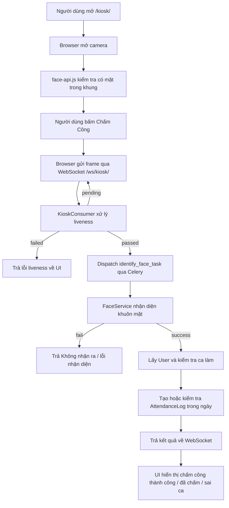

# Tài liệu kỹ thuật tính năng chấm công bằng khuôn mặt

Tài liệu này mô tả luồng chấm công bằng khuôn mặt trong trạng thái code hiện tại của dự án. Trọng tâm là giải thích hệ thống hoạt động từ màn kiosk, xác thực liveness, phát hiện giả mạo, trích xuất đặc trưng khuôn mặt, nhận diện nhân viên, kiểm tra ca làm, tới lưu log chấm công.

Các file chính liên quan:

- `attendance/templates/attendance/kiosk.html`
- `attendance/consumers.py`
- `attendance/tasks.py`
- `attendance/services/liveness_service.py`
- `attendance/services/replay_attack_detector.py`
- `attendance/services/anti_spoofing_service.py`
- `attendance/services/face_service.py`
- `attendance/services/face_detection.py`
- `attendance/services/face_alignment.py`
- `attendance/services/preprocessing.py`
- `attendance/services/embedding.py`
- `attendance/services/classifier.py`
- `attendance/services/cache_service.py`
- `attendance/models.py`

## 1. Tổng quan luồng chấm công

Luồng chấm công hiện tại có 4 bước chính trên UI:

1. Xác thực liveness.
2. Gửi ảnh lên server.
3. Phân tích đặc trưng khuôn mặt bằng CNN 512D.
4. Nhận diện nhân viên bằng vector search và SVM.

Ở mức hệ thống, luồng chạy như sau:



Nếu WebSocket không dùng được, frontend có nhánh fallback HTTP:

- POST `/api/kiosk/checkin/`
- Poll kết quả qua `/api/kiosk/result/<task_id>/`

Nhánh WebSocket là luồng chính, vì nó cho phép stream nhiều frame để liveness có dữ liệu thời gian.

## 2. Frontend kiosk

File chính: `attendance/templates/attendance/kiosk.html`.

### 2.1. Mở camera

Frontend gọi:

```js
navigator.mediaDevices.getUserMedia({
    video: { width: { ideal: 1280 }, height: { ideal: 720 }, facingMode: 'user' }
})
```

Camera được gắn vào thẻ `<video id="video">`. Một `<canvas id="overlay">` được đặt lên trên để vẽ khung mặt.

### 2.2. Kiểm tra mặt phía client bằng face-api.js

Frontend tải model:

```js
faceapi.nets.tinyFaceDetector.loadFromUri(MODEL_URL)
```

Sau đó chạy vòng lặp:

```js
faceapi.detectSingleFace(video, options)
```

Mục đích của bước này:

- Kiểm tra sơ bộ có khuôn mặt trong camera hay không.
- Vẽ bounding box màu xanh quanh mặt.
- Không phải là bước nhận diện danh tính thật.
- Không quyết định ai là nhân viên.

Nếu không detect được mặt, nút chấm công sẽ bị chặn hoặc báo người dùng đưa mặt vào khung.

### 2.3. Capture frame gửi server

Khi bấm `Chấm Công`, frontend vẽ frame hiện tại vào canvas rồi chuyển thành JPEG base64:

```js
canvas.toDataURL('image/jpeg', 0.8)
```

Nếu face-api.js có bounding box, frontend crop vùng mặt với margin 80px rồi gửi crop đó. Nếu không có box, nó gửi full frame.

Hiện tại WebSocket gửi frame mỗi 200ms, tức khoảng 5 FPS:

```js
setInterval(() => {
    let imageData = captureFrame();
    ws.send(JSON.stringify({
        type: 'checkin',
        image: imageData
    }));
}, 200);
```

Điểm cần lưu ý: vì frame gửi đi hiện là crop mặt nếu client detect được mặt, các detector cần nhìn bối cảnh rộng như phone frame detector có thể bị thiếu thông tin về viền điện thoại/màn hình. Nếu muốn bắt điện thoại đặt gần camera tốt hơn, nên tách hai ảnh:

- Full frame cho liveness/replay detection.
- Crop mặt cho recognition.

## 3. WebSocket consumer

File chính: `attendance/consumers.py`.

Class xử lý là `KioskConsumer`.

### 3.1. Kết nối WebSocket

Khi browser connect `/ws/kiosk/`, consumer:

- Tạo `group_name` theo channel name.
- Join channel layer group.
- Khởi tạo `LivenessService`.
- Set `self.liveness_passed = False`.
- Gửi message `connected` về browser.

### 3.2. Nhận frame từ browser

Browser gửi message:

```json
{
  "type": "checkin",
  "image": "data:image/jpeg;base64,..."
}
```

Consumer xử lý:

1. Cắt prefix `data:image/jpeg;base64,`.
2. Decode base64 thành bytes.
3. Dùng OpenCV `cv2.imdecode()` để thành ảnh BGR numpy array.
4. Nếu decode lỗi thì trả lỗi về UI.

### 3.3. Chạy liveness trước nhận diện

Nếu `self.liveness_passed == False`, consumer gọi:

```python
liveness_result = await sync_to_async(self.liveness_service.update)(img)
```

Kết quả có 3 trạng thái:

- `pending`: cần thêm frame, gửi feedback như "Vui lòng chớp mắt và quay đầu nhẹ".
- `failed`: phát hiện bất thường hoặc hết thời gian, reset session.
- `passed`: cho phép chuyển sang nhận diện khuôn mặt.

### 3.4. Dispatch nhận diện qua Celery

Sau khi liveness pass, consumer dispatch:

```python
identify_face_task.delay(image_data, None, self.group_name)
```

Celery xử lý ảnh ở background, sau đó push kết quả về group WebSocket qua channel layer.

Điểm cần lưu ý: nếu Celery hoặc channel layer gặp vấn đề, UI có thể đứng ở bước xử lý. Consumer có fallback `run_sync_fallback()` nếu gọi task lỗi, nhưng nếu task dispatch thành công mà kết quả không về thì UI vẫn phải chờ.

## 4. Liveness detection

File chính: `attendance/services/liveness_service.py`.

LivenessService là service có state theo từng WebSocket connection. Nó lưu buffer các frame trong một session để đánh giá hành vi theo thời gian.

### 4.1. MediaPipe FaceMesh

Service dùng MediaPipe FaceMesh để lấy landmarks khuôn mặt:

- Mắt.
- Mũi.
- Cằm.
- Miệng.
- Các điểm phục vụ head pose và liveness.

Nếu MediaPipe không detect được mặt, service trả:

```python
{"status": "pending", "feedback_ui": "Không tìm thấy khuôn mặt rõ ràng."}
```

### 4.2. Blink detection bằng EAR

EAR là Eye Aspect Ratio, tính từ 6 điểm landmark mỗi mắt:

- `LEFT_EYE = [33, 160, 158, 133, 153, 144]`
- `RIGHT_EYE = [362, 385, 387, 263, 373, 380]`

Công thức:

```text
EAR = (A + B) / (2 * C)
```

Trong đó:

- `A`, `B`: khoảng cách dọc giữa mí trên và mí dưới.
- `C`: khoảng cách ngang của mắt.

Khi mắt mở, EAR cao hơn. Khi chớp mắt, EAR giảm nhanh rồi tăng lại. Hệ thống không chỉ nhìn một frame mà nhìn biên độ EAR trong nhiều frame:

```python
ear_range = max(ears) - min(ears)
if ear_range > EAR_AMPLITUDE_MIN and min(ears) < EAR_THRESHOLD:
    blink_detected = True
```

Ngưỡng mặc định trong code:

- `EAR_THRESHOLD = 0.22`
- `EAR_AMPLITUDE_MIN = 0.08`

### 4.3. Head movement bằng PnP

Service dùng 6 landmark để ước lượng pose đầu:

- Nose tip.
- Chin.
- Left eye corner.
- Right eye corner.
- Left mouth.
- Right mouth.

OpenCV `cv2.solvePnP()` tính rotation vector, sau đó chuyển sang Euler angles:

- pitch: cúi/ngẩng.
- yaw: quay trái/phải.
- roll: nghiêng đầu.

Movement pass khi:

```python
yaw_range > YAW_RANGE_MIN or pitch_range > PITCH_RANGE_MIN
```

Ngưỡng mặc định:

- `YAW_RANGE_MIN = 8.0`
- `PITCH_RANGE_MIN = 6.0`

### 4.4. Temporal consistency

Temporal consistency kiểm tra độ dao động EAR trong buffer:

```python
TEMPORAL_STD_MIN <= std(EAR) <= TEMPORAL_STD_MAX
```

Ý nghĩa:

- Nếu quá tĩnh, có thể là ảnh đứng yên.
- Nếu quá nhiễu, có thể là camera/landmark không ổn định hoặc hành vi bất thường.

Ngưỡng mặc định:

- `TEMPORAL_STD_MIN = 0.005`
- `TEMPORAL_STD_MAX = 0.08`

### 4.5. Active liveness score

Ngoài logic classic `blink + movement + consistency`, service có `_active_liveness_score()` để chấm điểm mềm:

```python
score = 0.42 * blink_score
      + 0.42 * movement_score
      + 0.10 * consistency_score
      + 0.06 * frame_score
```

Điều kiện pass hiện tại:

```python
enough_frames = len(frame_buffer) >= MIN_PASS_FRAMES
strong_active_signal = blink_detected or movement_detected
score_passed = liveness_score >= PASS_SCORE_THRESHOLD
classic_passed = blink_detected and movement_detected and consistency_passed

if enough_frames and strong_active_signal and (score_passed or classic_passed):
    passed
```

Ngưỡng trong code:

- `MIN_PASS_FRAMES = 8`
- `PASS_SCORE_THRESHOLD = 0.52`

Cách này giúp người thật dễ pass hơn trong các trường hợp đeo kính, ánh sáng yếu, hoặc blink khó bắt.

## 5. Anti-spoofing và replay attack

Liveness hiện có thêm 2 lớp chống giả mạo:

- ONNX anti-spoofing model tùy chọn.
- Replay attack heuristic cho điện thoại/màn hình.

### 5.1. AntiSpoofingService

File: `attendance/services/anti_spoofing_service.py`.

Service này chỉ thật sự bật nếu cấu hình:

```text
ANTISPOOF_ONNX_MODEL_PATH
```

Nếu không có model, service trả điểm trung tính:

```python
{
    "enabled": False,
    "live_score": 1.0,
    "spoof_score": 0.0,
    "model": ""
}
```

Nếu có ONNX model:

1. Crop mặt dựa trên landmarks.
2. Resize theo `ANTISPOOF_INPUT_SIZE`, mặc định `(80, 80)`.
3. Chạy `onnxruntime.InferenceSession`.
4. Softmax output.
5. Tính `live_score` và `spoof_score`.

Nếu:

```python
spoof_score >= ANTISPOOF_SPOOF_THRESHOLD
```

thì liveness fail.

Ngưỡng mặc định:

- `ANTISPOOF_SPOOF_THRESHOLD = 0.65`

### 5.2. ReplayAttackDetector

File: `attendance/services/replay_attack_detector.py`.

Detector này nhắm vào tình huống người dùng đưa điện thoại/màn hình gần camera rồi lắc qua lại.

Nó tính 3 nhóm điểm:

1. `phone_frame`: phát hiện khung chữ nhật/viền màn hình quanh mặt.
2. `planar_motion`: phát hiện landmarks chuyển động giống một mặt phẳng 2D.
3. `screen_artifact`: phát hiện texture giống màn hình như moire, banding, brightness quá phẳng.

Điểm tổng:

```python
score = 0.42 * phone_frame
      + 0.38 * planar_motion
      + 0.20 * screen_artifact
```

Flag suspicious nếu:

```python
score >= 0.72 or phone_frame >= 0.86
```

Nếu replay risk vượt ngưỡng, liveness trả failed.

### 5.3. Giới hạn hiện tại

Các heuristic này không thể bảo đảm tuyệt đối. Một số tình huống dễ false positive/false negative:

- Crop mặt quá sát làm mất viền điện thoại.
- Ánh sáng phòng mạnh gây artifact giống màn hình.
- Kính phản chiếu gây nhiễu vùng mắt.
- Người dùng quay đầu quá nhanh hoặc quá gần camera.
- Camera chất lượng thấp làm landmark dao động.

Để robust hơn, nên tách full frame cho liveness/replay và crop mặt cho recognition.

## 6. Nhận diện khuôn mặt

File chính: `attendance/services/face_service.py`.

FaceService là facade điều phối toàn bộ pipeline:

```text
Detect -> Align -> Preprocess -> Embed -> Vector Search -> SVM Verify
```

### 6.1. Detect face

File: `attendance/services/face_detection.py`.

Detector ưu tiên RetinaFace nếu import được, fallback MTCNN từ `facenet_pytorch`.

Đầu ra mỗi face:

- `box`: bounding box `[x1, y1, x2, y2]`
- `confidence`: độ tin cậy detect
- `landmarks`: 5 điểm `[left_eye, right_eye, nose, mouth_left, mouth_right]`

Kiosk dùng:

```python
detect_largest(processed)
```

Hàm này chọn mặt tốt nhất bằng heuristic:

- Diện tích mặt lớn.
- Gần trung tâm ảnh.

Điều này phù hợp với kiosk, nơi thường chỉ kỳ vọng một người đứng trước camera.

### 6.2. Preprocess trước detect

File: `attendance/services/preprocessing.py`.

Trước detect:

1. Resize ảnh nếu quá lớn, giữ aspect ratio.
2. Apply CLAHE trên kênh luminance trong LAB color space.

CLAHE giúp cân bằng sáng trong môi trường tối/sáng lệch.

### 6.3. Align face

File: `attendance/services/face_alignment.py`.

Dựa vào 5 landmarks, hệ thống estimate similarity transform để đưa mắt, mũi, miệng về vị trí chuẩn.

Mục tiêu:

- Hai mắt nằm ngang hơn.
- Mặt được chuẩn hóa về size cố định.
- Embedding ổn định hơn giữa các lần chụp.

Nếu thiếu landmarks, hệ thống fallback center crop.

### 6.4. Preprocess trước embedding

Sau align, hệ thống tính brightness. Nếu mặt quá tối, apply CLAHE. Nếu đủ sáng, giữ nguyên để tránh làm hỏng feature.

```python
if mean_brightness < clahe_threshold:
    apply_clahe()
else:
    keep original
```

### 6.5. Embedding 512D

File: `attendance/services/embedding.py`.

Model hiện tại:

```python
InceptionResnetV1(pretrained='vggface2')
```

Đây là FaceNet-style embedding model từ `facenet_pytorch`.

Input:

- Aligned face.
- Resize 160x160.
- RGB.
- Normalize pixel về `[-1, 1]`.

Output:

- Vector 512 chiều.
- L2-normalized.

Vector này đại diện cho danh tính khuôn mặt trong không gian đặc trưng FaceNet/VGGFace2.

Quan trọng: vector 512D của FaceNet không tương thích trực tiếp với vector 512D của ArcFace/InsightFace. Cùng là 512 chiều nhưng không cùng không gian embedding.

## 7. Đăng ký khuôn mặt nhân viên

Các nơi tạo embedding:

- Tạo nhân viên kèm ảnh: `staff_create`.
- Sửa nhân viên upload lại ảnh: `staff_edit`.
- Nhân viên tự đăng ký mặt: `face_register`.

Pipeline đăng ký:

1. Decode ảnh upload bằng OpenCV.
2. `FaceService.register_face()` hoặc `register_multiple_images()`.
3. Detect mặt lớn nhất.
4. Align mặt.
5. Preprocess.
6. Augment ảnh mặt.
7. Extract embeddings.
8. Lưu embedding trung bình vào `User.face_encoding_text`.
9. Lưu nhiều embedding vào bảng `FaceEmbedding`.

### 7.1. Data augmentation

File: `attendance/services/augmentation.py`.

Từ một ảnh đăng ký, hệ thống tạo thêm biến thể:

- Flip ngang.
- Xoay nhẹ.
- Thay đổi brightness/contrast.
- Blur nhẹ.
- Gamma correction.
- Noise nhẹ.

Mục tiêu là tạo nhiều vector hơn để nhận diện ổn định hơn khi dữ liệu ít.

### 7.2. Lưu vector

Model: `FaceEmbedding`.

Nếu DB là PostgreSQL và có `pgvector`, dùng:

```python
VectorField(dimensions=512)
```

Nếu không có pgvector, fallback:

```python
embedding_json = models.TextField(default='[]')
```

Mỗi user có thể có nhiều FaceEmbedding:

- `original`
- `augmented`
- `registration`

## 8. Tìm kiếm vector và xác minh SVM

### 8.1. Vector search bằng pgvector

Trong `FaceService._search_database()`:

```python
FaceEmbedding.objects.annotate(
    distance=CosineDistance('embedding', embedding.tolist())
).order_by('distance')[:10]
```

Cosine distance càng thấp thì càng giống. Code đổi distance thành confidence:

```python
confidence = (1 - distance / 2) * 100
```

Sau đó cộng boost theo `quality_score`:

```python
weighted_conf = confidence + (quality_score * 5.0)
```

Nhưng confidence thực tế trả về vẫn là confidence gốc. Nếu confidence >= 55.0 thì nhận candidate.

### 8.2. Python fallback search

Nếu pgvector lỗi hoặc không dùng được, hệ thống dùng `FaceCacheService.get_all_embeddings()` để lấy tất cả embeddings rồi tính cosine similarity bằng numpy.

Cache service:

- Cache toàn bộ embeddings trong Redis/cache 1 giờ.
- Tự invalidate khi `FaceEmbedding` save/delete.
- Ưu tiên embedding có `quality_score` cao.

### 8.3. SVM verification

File: `attendance/services/classifier.py`.

Classifier dùng:

```python
SVC(kernel='rbf', probability=True, C=10.0, gamma='scale', class_weight='balanced')
```

Model lưu ở:

- `models/face_classifier.joblib`
- `models/label_encoder.joblib`

Trong nhận diện:

1. Vector search tìm user gần nhất.
2. Nếu SVM đã train, SVM predict user id và confidence.
3. Nếu vector search và SVM cùng user, đủ ngưỡng, pass.
4. Nếu SVM fail nhưng vector confidence rất cao, vẫn cho pass theo vector fallback.
5. Nếu conflict hoặc confidence thấp, trả Unknown.

Ngưỡng hiện tại trong code:

- `svm_threshold = 50.0`
- `cosine_threshold = 55.0`
- `cosine_high_threshold = 65.0`

### 8.4. Khi classifier chưa train

Nếu chưa có SVM model, hệ thống dùng vector-only:

- confidence >= 55.0 thì pass.
- thấp hơn thì Unknown.

## 9. Celery task nhận diện

File: `attendance/tasks.py`.

Task chính:

```python
identify_face_task(image_base64, previous_image_base64=None, channel_group_name=None)
```

Task làm:

1. Decode ảnh base64.
2. Chạy `FaceService.identify_face(img)`.
3. Nếu fail, push lỗi về WebSocket.
4. Nếu success, lấy `User`.
5. Kiểm tra ca làm.
6. Kiểm tra đã chấm công hôm nay chưa.
7. Tạo `AttendanceLog` nếu hợp lệ.
8. Push kết quả về WebSocket group.

Task có timeout:

- `soft_time_limit = 25`
- `time_limit = 30`

## 10. Logic ca làm và AttendanceLog

Model: `AttendanceLog`.

Một log có:

- `user`
- `timestamp`
- `status`
- `snapshot`

Status hiện tại:

- `ON_TIME`
- `LATE`
- `ABSENT`

### 10.1. Tính đi muộn

Trong `AttendanceLog.calculate_status()`:

- Lấy ca làm của user.
- Tính giờ bắt đầu ca.
- Cộng grace period.
- Nếu timestamp vượt grace period thì `LATE`.
- Ngược lại `ON_TIME`.

Nếu ca qua đêm, code xử lý trường hợp `start_time > end_time`.

### 10.2. Kiểm tra khoảng được chấm công

Trong Celery task, trước khi tạo log, hệ thống kiểm tra:

- Cho phép chấm sớm 60 phút trước giờ bắt đầu ca.
- Cho phép chấm muộn 30 phút sau giờ kết thúc ca.

Nếu ngoài khoảng này, trả `shift_error` và không tạo log mới.

### 10.3. Chống chấm công trùng ngày

Task kiểm:

```python
AttendanceLog.objects.filter(user=user, timestamp__date=today).first()
```

Nếu đã có log trong ngày:

- Không tạo log mới.
- Trả message "đã chấm công hôm nay lúc ...".
- `checkin_status = already_checked`.

## 11. Các trạng thái trả về UI

Kết quả thành công có dạng:

```json
{
  "success": true,
  "user_id": 1,
  "user_name": "staff01",
  "user_full_name": "Nguyen Van A",
  "confidence": 82.3,
  "avatar_url": "...",
  "shift_name": "Ca hành chính",
  "checkin_status": "success",
  "message": "Chấm công thành công! ..."
}
```

Các `checkin_status` quan trọng:

- `success`: chấm công thành công.
- `already_checked`: hôm nay đã có log.
- `shift_error`: chưa tới ca hoặc ngoài khoảng được chấm công.

Kết quả nhận diện fail thường có:

```json
{
  "success": false,
  "error": "Unknown",
  "feedback_ui": "Không nhận ra bạn, vui lòng thử lại."
}
```

## 12. Các điểm dễ gây lỗi trong thực tế

### 12.1. Dữ liệu vector cũ và vector mới

Nếu đổi backend embedding từ FaceNet sang InsightFace ArcFace thì cần re-embed lại toàn bộ nhân viên. Lý do:

- FaceNet 512D và ArcFace 512D không cùng không gian vector.
- Không nên so sánh vector FaceNet cũ với vector ArcFace mới.
- Cùng số chiều 512 không có nghĩa là tương thích.

Nếu hệ thống live dùng ArcFace nhưng DB đang lưu FaceNet, kết quả thường là "Không nhận ra bạn".

Khuyến nghị:

- Thêm field `embedding_model` hoặc `recognition_method` vào `FaceEmbedding`.
- Khi search chỉ so trong cùng model.
- Re-register hoặc batch re-embed ảnh nhân viên bằng model mới.

### 12.2. Liveness pass nhưng recognition fail

Nguyên nhân thường gặp:

- Ảnh gửi recognition bị crop sai hoặc crop quá rộng/quá sát.
- Mặt nghiêng quá nhiều.
- Kính phản sáng.
- Ánh sáng lệch.
- Dữ liệu đăng ký ít hoặc không giống góc hiện tại.
- Vector DB cũ khác model.
- SVM chưa train lại sau khi thêm/sửa embeddings.

### 12.3. UI đứng ở bước 3

Bước 3 là sau khi liveness pass và task nhận diện đã được gửi. Nếu đứng lâu:

- Celery worker chưa chạy.
- Redis broker lỗi.
- Task timeout.
- Channel layer không push được kết quả về WebSocket.
- Browser đang giữ WebSocket session cũ sau khi server reload.

Nên kiểm:

```powershell
celery -A myproject inspect active
celery -A myproject inspect reserved
```

Và log:

- `celery.log`
- `celery.err.log`
- `runserver.err.log`

### 12.4. `Object of type ndarray is not JSON serializable`

Lỗi này xuất hiện khi kết quả nhận diện có kèm `embedding` numpy array rồi bị đưa vào `json.dumps()` hoặc JSONField.

Giải pháp đúng:

- Không gửi `embedding` về UI.
- Không lưu raw numpy array vào JSONField.
- Convert numpy scalar sang Python float/int.
- Chỉ lưu metadata như confidence, method, risk score.

### 12.5. Đưa điện thoại gần camera vẫn pass

Nguyên nhân:

- Frame gửi lên server có thể là crop mặt, không thấy viền điện thoại.
- Replay detector cần nhiều frame và bối cảnh.
- Nếu người dùng lắc điện thoại, head movement vẫn có thể được tính là chuyển động sống.

Khuyến nghị:

- Gửi full frame cho liveness/replay detector.
- Gửi crop face riêng cho recognition.
- Thêm ONNX anti-spoofing model thật.
- Tăng trọng số planar motion/phone frame nếu môi trường kiosk cố định.

## 13. Cấu hình quan trọng

Trong `myproject/settings.py` có các nhóm cấu hình chính:

### 13.1. Channels

```python
ASGI_APPLICATION = 'myproject.asgi.application'
CHANNEL_LAYERS = {
    'default': {
        'BACKEND': 'channels_redis.core.RedisChannelLayer',
        'CONFIG': {
            'hosts': [os.getenv('REDIS_URL', 'redis://localhost:6379/0')],
        },
    },
}
```

### 13.2. Celery

```python
CELERY_BROKER_URL = REDIS_URL
CELERY_RESULT_BACKEND = REDIS_URL
CELERY_TASK_TIME_LIMIT = 30
CELERY_TASK_SOFT_TIME_LIMIT = 25
```

### 13.3. Liveness

Các ngưỡng được đọc trong `LivenessService`:

- `LIVENESS_EAR_THRESHOLD`
- `LIVENESS_EAR_AMPLITUDE_MIN`
- `LIVENESS_YAW_RANGE_MIN`
- `LIVENESS_PITCH_RANGE_MIN`
- `LIVENESS_TEMPORAL_STD_MIN`
- `LIVENESS_TEMPORAL_STD_MAX`
- `LIVENESS_TIMEOUT_SECONDS`
- `LIVENESS_MIN_PASS_FRAMES`
- `LIVENESS_PASS_SCORE_THRESHOLD`
- `LIVENESS_REPLAY_RISK_THRESHOLD`
- `ANTISPOOF_SPOOF_THRESHOLD`

### 13.4. Anti-spoofing ONNX

```python
ANTISPOOF_ONNX_MODEL_PATH
ANTISPOOF_INPUT_SIZE
ANTISPOOF_LIVE_CLASS_INDEX
ANTISPOOF_SPOOF_THRESHOLD
```

Nếu không set model path, anti-spoofing model không hoạt động thật mà chỉ trả neutral score.

## 14. Các lệnh vận hành thường dùng

### 14.1. Chạy migration

```powershell
.\venv\Scripts\python.exe manage.py migrate
```

### 14.2. Chạy server

```powershell
.\venv\Scripts\python.exe manage.py runserver
```

### 14.3. Chạy Celery worker

```powershell
.\venv\Scripts\celery.exe -A myproject worker -l info -P solo
```

Trên Windows nên dùng `-P solo`.

### 14.4. Train lại classifier

```powershell
.\venv\Scripts\python.exe manage.py train_classifier
```

Nên chạy lại sau khi:

- Thêm nhân viên mới.
- Upload lại ảnh mặt.
- Xóa embeddings cũ.
- Re-embed bằng model mới.

### 14.5. Migrate encoding cũ

Project có command:

```powershell
.\venv\Scripts\python.exe manage.py migrate_encodings
```

Command này dùng để migrate dữ liệu encoding cũ. Cần đọc kỹ option của command trước khi chạy thật, đặc biệt nếu có chế độ dry-run hoặc migrate từ ảnh.

## 15. Đề xuất nâng cấp tiếp theo

### 15.1. Tách ảnh liveness và ảnh recognition

Hiện frontend gửi một ảnh duy nhất. Nên gửi:

```json
{
  "type": "checkin",
  "image": "full_frame_for_liveness",
  "recognition_image": "face_crop_for_recognition"
}
```

Server:

- Dùng `image` cho liveness/replay.
- Dùng `recognition_image` cho FaceService.

### 15.2. Lưu model name cho FaceEmbedding

Thêm field:

```python
embedding_model = models.CharField(max_length=50, default='facenet_vggface2')
```

Khi search:

- Live embedding model nào thì chỉ search embeddings cùng model đó.

### 15.3. Re-embed toàn bộ nhân viên

Nếu muốn đổi sang InsightFace ArcFace:

1. Thêm backend ArcFace.
2. Thêm `embedding_model`.
3. Re-embed ảnh nhân viên bằng ArcFace.
4. Train lại classifier hoặc chuyển sang vector top-k only.
5. Không mix FaceNet và ArcFace trong cùng search.

### 15.4. Lưu evidence vào AttendanceLog

Hiện `AttendanceLog` chỉ lưu thông tin cơ bản. Nên mở rộng:

- `face_confidence`
- `liveness_score`
- `spoof_score`
- `replay_score`
- `recognition_method`
- `risk_score`
- `evidence` JSON

Điều này giúp admin audit các ca đáng ngờ.

### 15.5. Thêm manual review

Nên thêm status:

- `MANUAL_REVIEW`
- `SUSPICIOUS`

Nếu risk cao, không nên tự động reject/accept ngay mà đưa vào hàng chờ admin xác minh.

### 15.6. Quan sát realtime

Nên log structured JSON cho:

- liveness pass/fail
- replay score
- anti-spoof score
- vector top candidate
- second candidate
- SVM confidence
- latency

Nhờ đó khi user báo "không nhận ra", có thể biết fail ở bước nào.

## 16. Kết luận

Hệ thống hiện tại là một pipeline FaceNet/SVM kết hợp liveness bằng MediaPipe:

- Frontend kiểm tra mặt sơ bộ bằng face-api.js.
- WebSocket stream frame lên server.
- MediaPipe xác thực liveness qua blink, head movement, temporal consistency.
- Anti-spoofing ONNX là tùy chọn.
- Replay detector phát hiện điện thoại/màn hình bằng heuristic.
- FaceNet/InceptionResnetV1 trích xuất embedding 512D.
- pgvector hoặc Python cosine search tìm ứng viên.
- SVM xác minh lại danh tính.
- Celery xử lý nhận diện nền và push kết quả về WebSocket.
- AttendanceLog lưu kết quả đúng giờ/muộn và chống chấm công trùng ngày.

Điểm quan trọng nhất khi nâng cấp là không trộn lẫn embedding từ các model khác nhau. Nếu đổi FaceNet sang ArcFace, cần migration dữ liệu embedding rõ ràng, có đánh dấu model, và train/search theo cùng một không gian vector.
